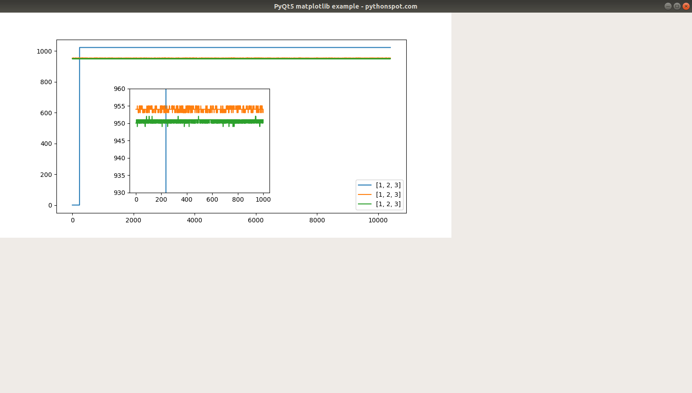

# Record
## CAEN Digiter
C++ code control the digiter
## Gui
### Cern ROOT
abandon
### QT
### pybind11+pyqt
+ [GCC and MSVC C++ Demangler ](http://demangler.com/)
    use pybind11 wrap the c++ code
+ read the wave and update in time
    
